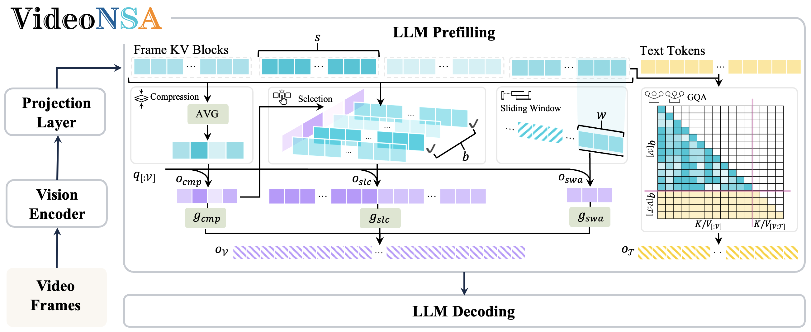

# VideoNSA: Native Sparse Attention for Video Understanding

<div align="center">
  
</div>

<div align="center">

[[Paper](https://arxiv.org/abs/2510.02295)] [[Project Page](https://enxinsong.com/VideoNSA-web/)] [[Model](https://huggingface.co/Enxin/VideoNSA)]

</div>

VideoNSA is a learnable, hardware-aware sparse-attention framework for efficient video understanding, processing up to 128K vision-text tokens using only 3.6% of the full attention budget.

## News

- **[2025-10]** Paper released on arXiv
- **[2025-10]** Code and models released
- **[2025-10]** Project website launched
- **[TODO]** Training dataset release

## Installation

### For Training

```bash
# Clone the repository
git clone https://github.com/Espere-1119-Song/VideoNSA.git
cd VideoNSA

# Install ms-swift
cd ms-swift
pip install -e .

# Install flash-linear-attention
pip uninstall fla-core flash-linear-attention -y
pip install -U git+https://github.com/fla-org/flash-linear-attention

cd ..
```

### For Evaluation

```bash
# Install UV package manager
pip install uv

# Install lmms-eval
uv pip install git+https://github.com/EvolvingLMMs-Lab/lmms-eval.git

# Install additional dependencies
pip install flash-attn --no-build-isolation
pip install qwen_vl_utils
pip install accelerate

# Login to Hugging Face
huggingface-cli login
```

### For Baseline Comparisons (Optional)

```bash
# Install MInference for testing other sparse attention baselines
pip install minference
```

## Usage

### Training

```bash
cd ms-swift

# Run training script
bash ../scrips/train.sh
```

**Note**: Before training, modify the following in `scrips/train.sh`:
- `$YOUR_DATASET`: Path to your training dataset
- `--output_dir`: Output directory for checkpoints
- `--logging_dir`: Directory for logs
- GPU settings (`CUDA_VISIBLE_DEVICES`, `NPROC_PER_NODE`, `WORLD_SIZE`)
- Hyperparameters (learning rate, batch size, etc.)

### Evaluation

```bash
cd lmms-eval

# Run evaluation script
bash ../scrips/eval.sh
```

**Note**: Before evaluation, set the following environment variables in `scrips/eval.sh`:
- `$MAX_PIXELS`: Maximum pixels for video processing
- `$FPS`: Frames per second for video sampling
- `$MAX_NUM_FRAMES`: Maximum number of frames
- `$TASK_NAME`: Benchmark task name (e.g., `mvbench`, `videomme`, etc.)

You can also modify:
- `--num_processes`: Number of GPUs to use
- `--batch_size`: Batch size per device
- `--output_path`: Directory for evaluation results

### Baseline Comparisons

To evaluate sparse attention baselines used in the paper:

```bash
cd lmms-eval

# Make sure minference is installed
pip install minference

# Run baseline evaluation
bash ../scrips/baselines.sh
```

**Note**: Modify the baseline script to select different sparse attention methods and configure their parameters.

## Citation

```bibtex
@misc{song2025videonsanativesparseattention,
      title={VideoNSA: Native Sparse Attention Scales Video Understanding},
      author={Enxin Song and Wenhao Chai and Shusheng Yang and Ethan Armand and Xiaojun Shan and Haiyang Xu and Jianwen Xie and Zhuowen Tu},
      year={2025},
      eprint={2510.02295},
      archivePrefix={arXiv},
      primaryClass={cs.CV},
      url={https://arxiv.org/abs/2510.02295},
}
```

